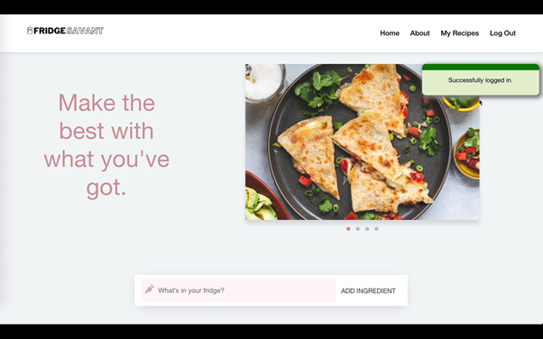
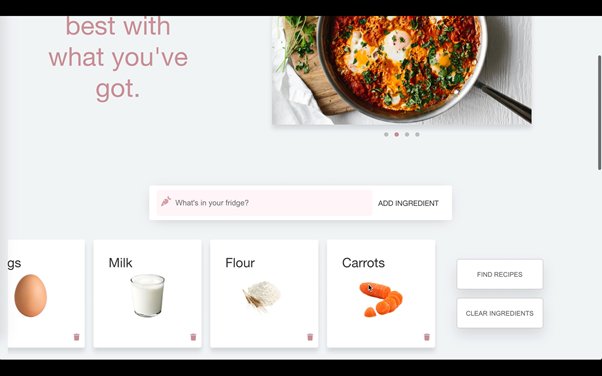
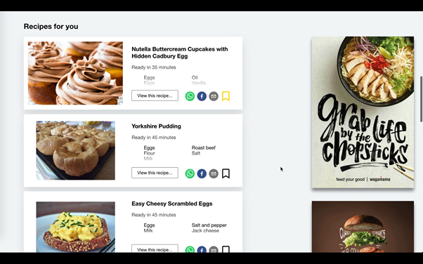
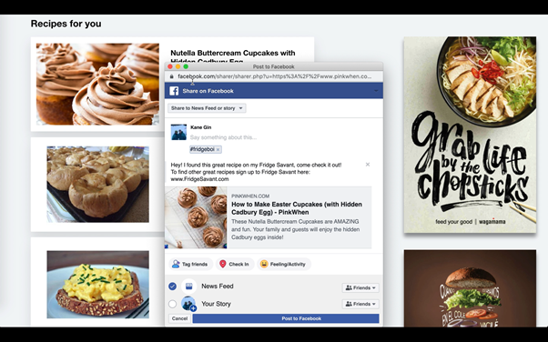
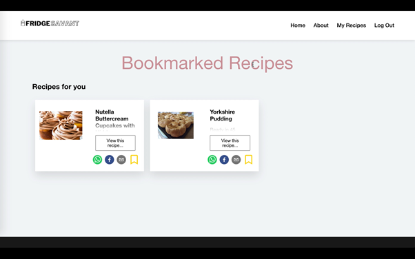
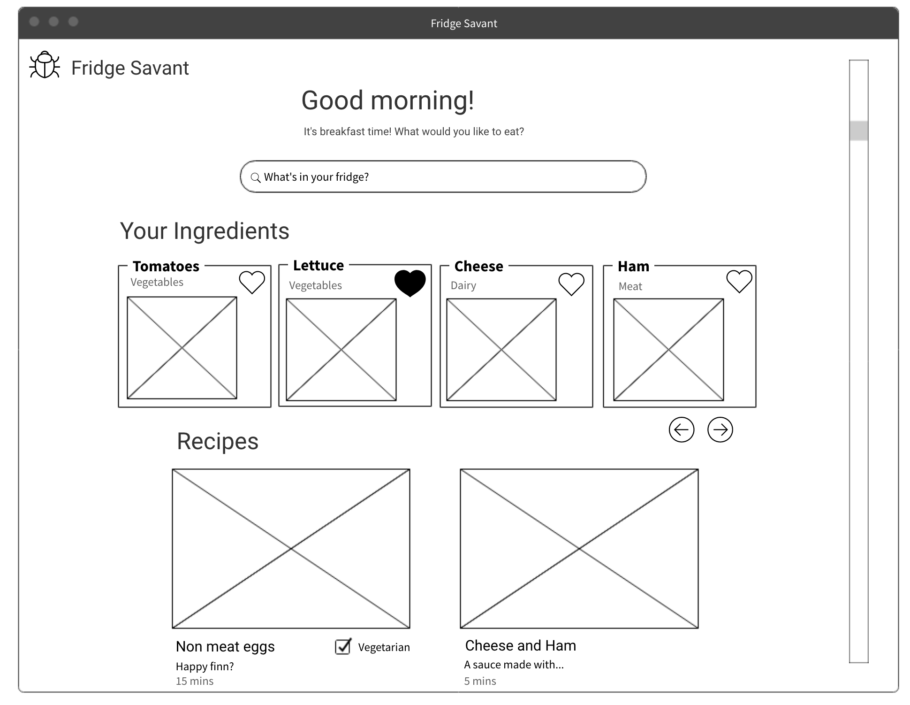
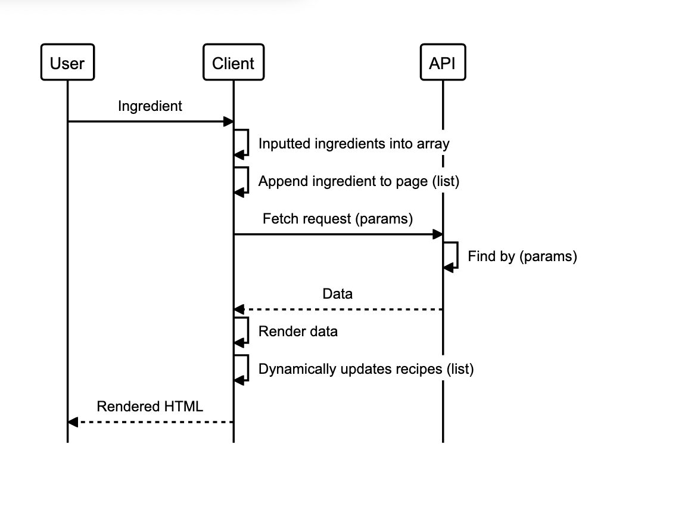

## Concept
----------------------------------------------

<p><strong><em>Fridge Savant is a virtual kitchen assistant to help you make the best with what you've got.</em></strong></p>

<p> Designed to inspire creativity in the kitchen when your fridge looks bare, the app makes decision making easier when it comes to meal times. By encouraging you to use up the ingredients you have to hand, Fridge Savant helps you to reduce food waste, and so manage your budget better. </p>

<p> A video demo can be found [here](https://drive.google.com/file/d/1kjQj2J2epcq-nY_oSBYSRr8ERoaZj8zu/view?usp=sharing)</p>
<p> The app is deployed [here](https://immense-woodland-94956.herokuapp.com/login). When logging in it make take time to boot up the server side, or you can skip the login by visiting the root directory</p>

## Screenshots

<details>
<summary>Sign Up page</summary>
<br>

</details>

<details>
<summary>Home page with login flash message</summary>
<br>

</details>

<details>
<summary>Items added to basket</summary>
<br>

</details>

<details>
<summary>Recipe search results</summary>
<br>

</details>

<details>
<summary>Share Recipes</summary>
<br>

</details>

<details>
<summary>Bookmarks page</summary>
<br>

</details>


----------------------------------------------
## Table of Contents
----------------------------------------
  - [Concept](#concept)
  - [Screenshots](#Screenshots)
  - [Setup](#setup)
  - [Features](#features)
  - [Tech Stack](#tech-stack)
    - [Dependencies](#dependencies)
  - [Design and Approach](#design-and-approach)
    - [Project Management](#project-management)
    - [User stories](#user-stories)
    - [Diagrams and Models](#diagrams)
  - [Project Goals](#project-goals)
  - [Reflections](#reflections)

----------------------------------------------
## Setup 
----------------------------------------
To run the app - clone this repo and install dependencies: \
\
`Client Side`
```
$ git clone https://github.com/KaneG9/fridge-savant-client.git
$ cd fridge-savant-client
$ yarn install
```
Create and configure `.env` to add your API key
```
Create a spoonacular account at https://spoonacular.com/food-api
add your API key to the .env file as shown in the .env.example file
```
`Server Side`
The server side for this project can be found in a separate repo [here](https://github.com/KaneG9/fridge-savant-server)
```
$ git clone https://github.com/KaneG9/fridge-savant-server.git
$ cd fridge-savant-server
$ npm install
```
In the client project directory, run:

```
 yarn start
```
In the server project directory, run:

```
npm start
```

Runs the app in the development mode.\
Open [http://localhost:3000](http://localhost:3000) to view it in the browser.


---------------------------------------
## Features
----------------------------------------
- [x] Create an account
- [x] Log in and log out with an authentication token saved in local storage
- [x] Add ingredients to your basket
- [x] Find recipes based on your basket
- [x] Share recipes on social media
- [x] Add bookmarks to favorite recipes 
- [ ] Profile page

----------------------------------------
## Tech Stack
----------------------------------------
### Codebase:
- MongoDB
- Express
- React
- Node

### Testing Framework: 
- Jest

----------------------------------------
## Design and Approach
----------------------------------------
### Project Management
- [Trello Board](https://trello.com/b/U40Atkm9/fridge)

### User stories
```
As a user,
So I can show whats ingredients I have,
I would like to be able to add ingredients to my basket
```
```
As a user, 
So I can work out what to cook,
I would like to be able to see recipes based on my basket
```
```
As a user, 
So I can save my information,
I would like to be able to create an account
```
```
As a user,
So I can tell everyone what I am cooking,
I would like to be able to share my recipes on social media
```
```
As a user,
So I can save my favourite recipes,
I would like to be able to bookmark recipes
```
```
As a user,
So I can view my bookmarks,
I need a my recipes page
```

### Diagrams

<details>
  <summary> Design mock up </summary> <br>
    
  <br>
</details>

<details>
  <summary> MVP sequence diagram </summary> <br>
    
  <br>
</details>
<br>

----------------------------------------
## Project Goals
----------------------------------------
- To learn a new tech stack (MERN)
- 95% Test coverage
- Produce a high quality finished article 
----------------------------------------
## Reflections
----------------------------------------
Our main goal of the project was to produce a high quality finished article. In order to ensure this was the case we decided to focus on producing fewer features but making sure they were well styled and the user experience was smooth and enjoyable.

As a team we decided to use the MERN stack to build this project. This was a brand new technology for the whole group and therefore a significant amount of time was devoted to understanding the stack. Initially we planned to have everyone work on both the server and client side to gain maximum exposure, however very quickly we realised that this would not work due to the amount of learning required to understand each of the new technologies. After the project I will be spending some time to try and fully understand how the server side works and potentially implement a new feature for practice.

Throughout the project we worked on a single zoom call using breakout rooms, this meant we could emulate working in an office environment as closely as possible as we could move from room to room in order to communicate effectively, share knowledge and seek help when needed. 

Each day we had a morning stand up to let the rest of the group know what each pair was working on, merge code from the previous day, bring up issues which people needed help on and plan what needed to be done for the day. In the afternoons we also had a retro in which we discussed what had been completed during the day as well as sharing knowledge on useful topics.

----------------------------------------
## Progression Ideas
----------------------------------------
- Dietary requirements for searches
- Add more filters for meal (e.g. sweet or savoury)
- Nutrition information on the recipes
- Display full recipes within the web page rather than link to exernal websites
- Add a profile page

----------------------------------------

## *Fridge Savant* was built by:
- Matt Dawson | [GitHub](https://github.com/MattDawson2020)
- Noa Farber | [GitHub](https://github.com/noarfarber)
- Kane Gin | [GitHub](https://github.com/KaneG9)
- Mike Jeuga | [GitHub](https://github.com/mikejeuga)
- Jason Rowsell | [GitHub](https://github.com/jasonrowsell)
- Finn Williamson | [GitHub](https://github.com/fwill22)


---

[Top](#concept)

---
